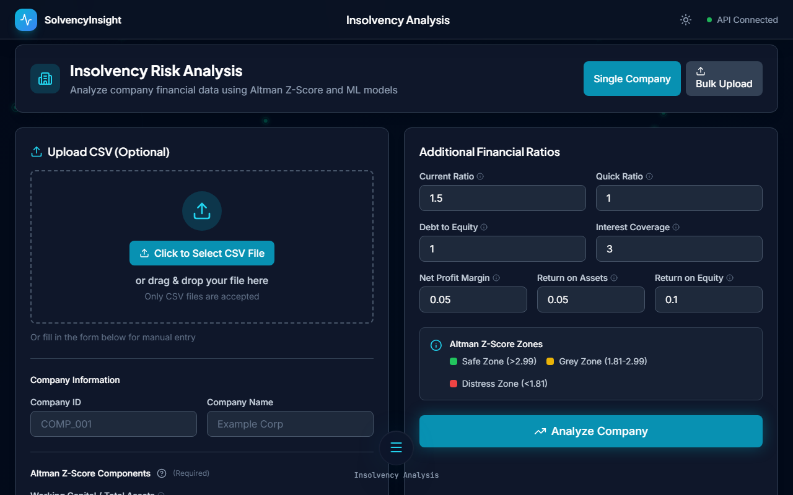

# SolvencyInsight

An AI-powered insolvency prevention and workforce optimization platform. Predicts company bankruptcy risk using Altman Z-Score + XGBoost, evaluates employee attrition with retention scoring, and simulates layoff scenarios -- all with SHAP explainability.

## Screenshots

### Dashboard

*Executive dashboard with live market signals, risk distribution, department attrition, and tracked companies*

### Insolvency Analysis

*Single or bulk company analysis with Altman Z-Score, 12 financial ratios, and SHAP risk driver explanations*

### Employee Scoring

*Bulk CSV upload for attrition prediction with retention scores, risk categorization, and per-employee SHAP breakdown*

### Layoff Simulation

*Budget-constrained workforce optimization with department minimums, retention comparison, and exportable recommendations*

## Features

- **Insolvency Risk Prediction** -- XGBoost on 12 financial ratios with Platt-calibrated probabilities and SHAP waterfall charts
- **Altman Z-Score** -- Classical 1968 formula with Safe / Grey / Distress zone classification
- **Employee Attrition Prediction** -- XGBoost on 18 features with weighted retention scoring
- **Layoff Simulation** -- Budget-targeted recommendations respecting department minimums
- **Enhanced Prediction** -- Blends ML with live market intelligence (news sentiment, sector performance, economic indicators)
- **PDF Reports** -- Professional insolvency and layoff reports generated with ReportLab
- **Company Comparison** -- Side-by-side analysis of two companies with dual SHAP charts
- **Input Validation** -- Pydantic Field constraints, accounting identity checks (QR <= CR, DuPont, WC/CR)
- **Dark / Light Theme** -- Persistent preference with glassmorphic UI and Framer Motion animations

## Tech Stack

| Layer | Technologies |
|-------|-------------|
| **Frontend** | React 19, TypeScript 5.9, Vite 7, Tailwind CSS 3.4, Framer Motion 12, Recharts 3, Remotion 4, Axios |
| **Backend** | FastAPI, Python 3.11, Pydantic 2, Uvicorn |
| **ML** | XGBoost 2, scikit-learn (CalibratedClassifierCV, cross_val_score), SHAP, NumPy, Pandas |
| **Services** | ReportLab (PDF), httpx + BeautifulSoup (market intelligence), NewsAPI, FRED, Alpha Vantage |
| **Infra** | Docker Compose, Nginx (reverse proxy, gzip, SPA routing), GitHub Actions CI/CD |

## Quick Start

### Local Development

```bash
# Backend
cd backend
pip install -r requirements.txt
uvicorn app.main:app --reload --host 127.0.0.1 --port 8000

# Frontend (new terminal)
cd frontend
npm install
npm run dev
```

### Docker

```bash
docker-compose up --build
```

| Service | URL |
|---------|-----|
| Frontend | http://localhost:3000 (Docker) or http://localhost:5173 (dev) |
| Backend API | http://localhost:8000 |
| API Docs | http://localhost:8000/docs |

## API Reference

| Method | Endpoint | Description |
|--------|----------|-------------|
| GET | `/api/health` | Health check with model metrics |
| POST | `/api/financial/analyze` | Single company insolvency analysis + SHAP |
| POST | `/api/financial/upload-single` | Single company from CSV |
| POST | `/api/financial/upload` | Bulk company analysis |
| GET | `/api/financial/feature-importance` | XGBoost feature importances |
| POST | `/api/financial/explain-row` | SHAP for one row of bulk CSV |
| POST | `/api/employee/analyze` | Single employee attrition analysis |
| POST | `/api/employee/upload` | Bulk employee analysis |
| POST | `/api/employee/simulate-layoff` | Layoff simulation |
| GET | `/api/employee/feature-importance` | Employee model importances |
| POST | `/api/reports/insolvency` | Generate insolvency PDF report |
| POST | `/api/reports/layoff` | Generate layoff PDF report |
| POST | `/api/market-intelligence` | News sentiment + sector data |
| POST | `/api/financial/analyze-enhanced` | ML + market intelligence blend |

## Model Performance

| Model | Accuracy | Precision | Recall | F1 | ROC-AUC | CV AUC (5-fold) |
|-------|----------|-----------|--------|----|---------|----|
| Insolvency (XGBoost) | 91.0% | 86.4% | 76.0% | 80.9% | 94.1% | 95.8% +/- 2.4% |
| Employee (XGBoost) | 92.0% | 70.0% | 87.5% | 77.8% | 97.2% | -- |

## Project Structure

```
insolvency-prevention-system/
├── backend/app/
│   ├── main.py                  # FastAPI app, 20+ endpoints, lifespan
│   ├── models/schemas.py        # Pydantic models with Field(ge/le) bounds
│   ├── routes/                  # financial.py, employee.py, reports.py
│   └── services/                # market_intelligence, pdf_generator, enhanced_prediction
├── frontend/src/
│   ├── pages/                   # 7 pages (Landing, Dashboard, Insolvency, Compare, Employees, Layoffs, Reports)
│   ├── components/              # 18 components (RiskGauge, ShapChart, FloatingNav, RotatingCube, ...)
│   ├── hooks/useTilt.ts         # 3D tilt effect hook
│   ├── context/                 # ThemeContext, ToastContext
│   └── services/api.ts          # Axios client with interceptors
├── ml_models/
│   ├── insolvency_predictor.py  # XGBoost + Platt scaling + SHAP + input validation
│   └── employee_scorer.py       # XGBoost + retention scoring + layoff simulation
├── data/generate_dummy_data.py  # Synthetic data with accounting identity enforcement
├── tests/                       # 14 pytest tests (8 API + 6 data validation)
├── docker-compose.yml
└── .github/workflows/ci.yml     # Lint, test, build, Docker, Trivy security scan
```

## Configuration

Copy `.env.example` to `.env` and configure:

| Variable | Description | Default |
|----------|-------------|---------|
| `DATA_SOURCE` | `synthetic` or `real` | `synthetic` |
| `SOLVENCY_API_KEY` | Optional API key for auth | empty (disabled) |
| `VITE_API_URL` | Frontend API base URL | `http://localhost:8000` |
| `NEWS_API_KEY` | NewsAPI.org key (market intelligence) | empty |
| `FRED_API_KEY` | Federal Reserve data key | empty |

## License

MIT License. See [LICENSE](LICENSE) for details.

## Acknowledgments

- [Altman Z-Score](https://en.wikipedia.org/wiki/Altman_Z-score) (1968) for bankruptcy prediction methodology
- [SHAP](https://github.com/slundberg/shap) for model explainability
- [FastAPI](https://fastapi.tiangolo.com/) for the async API framework
- [Damodaran Online](https://pages.stern.nyu.edu/~adamodar/) for real-world financial ratio benchmarks
