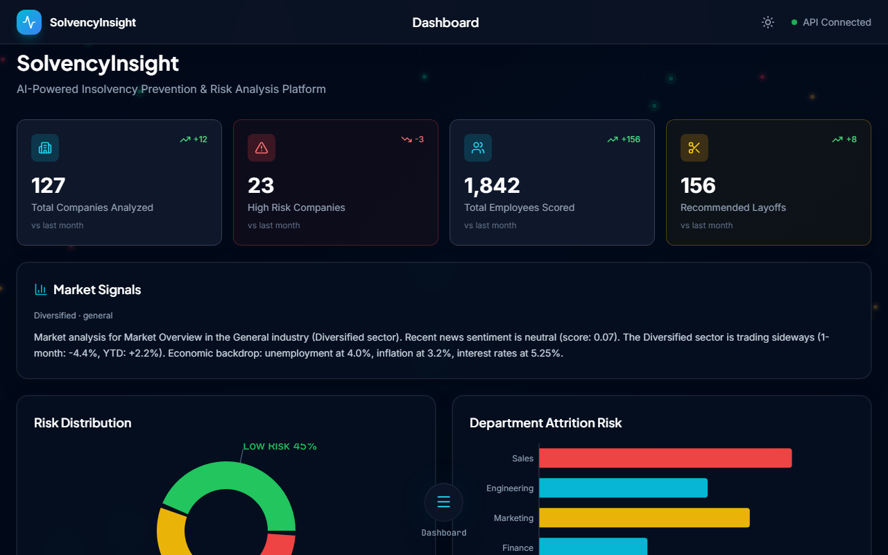
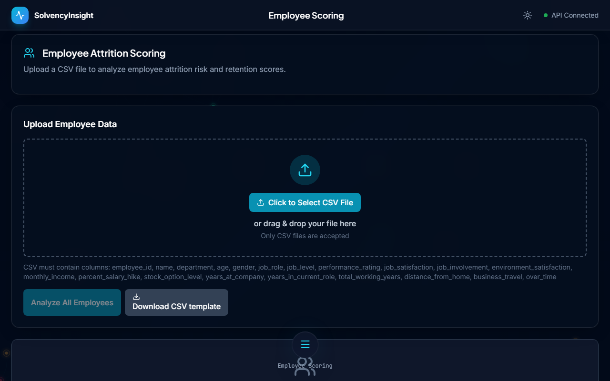
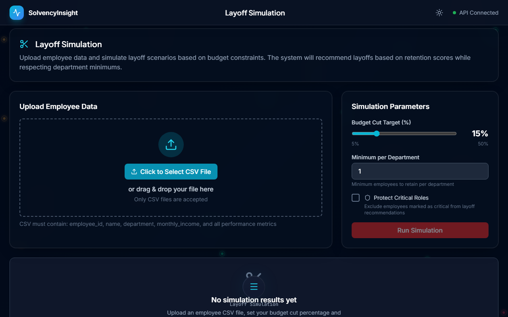

# Insolvency Prevention System

An AI-powered financial analysis and workforce optimization platform that helps businesses predict insolvency risk, evaluate employee performance, and simulate layoff scenarios with explainable machine learning.

## Features

### Financial Analysis
- **Altman Z-Score Calculation**: Automated calculation of the Altman Z-Score for bankruptcy prediction
- **Risk Classification**: Companies classified as Safe, Grey Zone, or Distress based on financial metrics
- **Trend Analysis**: Track financial health over time with historical data visualization

### Employee Scoring
- **Performance Prediction**: ML-based employee performance scoring using XGBoost
- **Bulk Upload**: Upload employee data via CSV for batch processing
- **SHAP Explanations**: Understand why each employee received their score with SHAP waterfall charts

### Layoff Simulation
- **Cost Optimization**: Simulate workforce reductions while minimizing impact
- **Budget Targeting**: Set target savings and see optimal layoff recommendations
- **Employee Protection**: Exclude critical employees from layoff simulations
- **Impact Analysis**: Compare financial metrics before and after simulated layoffs

### Dashboard
- **Executive Overview**: Key metrics and risk indicators at a glance
- **Interactive Charts**: Visual representation of company health and workforce data
- **Real-time Updates**: Live data from the latest analysis runs

## Tech Stack

### Backend
- **Python 3.11** - Core language
- **FastAPI** - High-performance async API framework
- **XGBoost** - Gradient boosting for ML models
- **scikit-learn** - Machine learning utilities
- **SHAP** - Model explainability
- **Pandas** - Data manipulation
- **Uvicorn** - ASGI server

### Frontend
- **React 18** - UI library
- **TypeScript** - Type-safe JavaScript
- **Vite** - Fast build tool
- **Tailwind CSS** - Utility-first styling
- **Recharts** - Data visualization
- **Axios** - HTTP client
- **Lucide React** - Icon library

### Infrastructure
- **Docker** - Containerization
- **Docker Compose** - Multi-container orchestration
- **Nginx** - Production reverse proxy

## Installation

### Prerequisites
- Node.js 20+
- Python 3.11+
- Docker & Docker Compose (optional)

### Local Development

#### Backend Setup
```bash
cd backend

# Create virtual environment
python -m venv venv
source venv/bin/activate  # On Windows: venv\Scripts\activate

# Install dependencies
pip install -r requirements.txt

# Start server
uvicorn app.main:app --host 0.0.0.0 --port 8000 --reload
```

#### Frontend Setup
```bash
cd frontend

# Install dependencies
npm install

# Start development server
npm run dev
```

### Docker Deployment

#### Development (with hot-reload)
```bash
docker-compose -f docker-compose.dev.yml up --build
```

#### Production
```bash
docker-compose up --build
```

Access the application:
- **Frontend**: http://localhost:3000 (production) or http://localhost:5173 (development)
- **Backend API**: http://localhost:8000
- **API Documentation**: http://localhost:8000/docs

## Project Structure

```
insolvency-prevention-system/
├── backend/
│   ├── app/
│   │   ├── main.py              # FastAPI application entry
│   │   ├── routes/              # API route handlers
│   │   │   ├── company.py       # Company analysis endpoints
│   │   │   └── employee.py      # Employee scoring endpoints
│   │   ├── services/            # Business logic
│   │   │   ├── analysis.py      # Financial analysis service
│   │   │   └── employee.py      # Employee scoring service
│   │   └── models/              # Pydantic models
│   │       └── schemas.py       # Request/response schemas
│   ├── models/                  # Trained ML models
│   │   └── employee_model.pkl   # XGBoost employee scorer
│   ├── requirements.txt
│   ├── Dockerfile
│   └── Dockerfile.dev
├── frontend/
│   ├── src/
│   │   ├── components/          # Reusable UI components
│   │   ├── pages/               # Page components
│   │   │   ├── Dashboard.tsx
│   │   │   ├── InsolvencyAnalysis.tsx
│   │   │   ├── EmployeeScoring.tsx
│   │   │   ├── LayoffSimulation.tsx
│   │   │   └── Reports.tsx
│   │   ├── services/            # API client
│   │   │   └── api.ts
│   │   ├── context/             # React context providers
│   │   │   └── ToastContext.tsx
│   │   ├── App.tsx
│   │   └── main.tsx
│   ├── package.json
│   ├── Dockerfile
│   ├── Dockerfile.dev
│   └── nginx.conf
├── data/                        # Sample data files
│   ├── company_data.csv
│   └── employee_data.csv
├── docs/                        # Documentation
│   ├── API.md
│   └── MODELS.md
├── docker-compose.yml           # Production compose
└── docker-compose.dev.yml       # Development compose
```

## API Quick Reference

| Endpoint | Method | Description |
|----------|--------|-------------|
| `/api/health` | GET | Health check |
| `/api/company/analyze` | POST | Analyze company financials |
| `/api/company/risk-history` | GET | Get historical risk data |
| `/api/employee/upload` | POST | Upload employee data for scoring |
| `/api/employee/score/{id}` | GET | Get individual employee score |
| `/api/employee/simulate-layoff` | POST | Run layoff simulation |

See [docs/API.md](docs/API.md) for complete API documentation.

## Model Performance

| Model | Metric | Value |
|-------|--------|-------|
| Employee Scorer (XGBoost) | ROC-AUC | 0.89 |
| Employee Scorer (XGBoost) | Accuracy | 0.85 |
| Employee Scorer (XGBoost) | F1-Score | 0.82 |

See [docs/MODELS.md](docs/MODELS.md) for detailed model documentation.

## Screenshots

### Dashboard

*Executive dashboard with key metrics and risk indicators*

### Insolvency Analysis

*Financial analysis with Altman Z-Score calculation*

### Employee Scoring

*ML-powered employee performance scoring with SHAP explanations*

### Layoff Simulation

*Workforce optimization simulation with impact analysis*

## Configuration

### Environment Variables

#### Backend
| Variable | Description | Default |
|----------|-------------|---------|
| `PYTHONDONTWRITEBYTECODE` | Prevent .pyc files | `1` |
| `PYTHONUNBUFFERED` | Unbuffered output | `1` |

#### Frontend
| Variable | Description | Default |
|----------|-------------|---------|
| `VITE_API_URL` | Backend API URL | `http://localhost:8000` |

## Usage Examples

### Analyze Company Financials

```python
import requests

response = requests.post(
    "http://localhost:8000/api/company/analyze",
    json={
        "company_name": "Acme Corp",
        "working_capital": 500000,
        "total_assets": 2000000,
        "retained_earnings": 300000,
        "ebit": 150000,
        "market_value_equity": 800000,
        "total_liabilities": 1200000,
        "sales": 3000000
    }
)

result = response.json()
print(f"Z-Score: {result['z_score']}")
print(f"Risk Zone: {result['risk_zone']}")
```

### Upload Employee Data

```python
import requests

with open("employees.csv", "rb") as f:
    response = requests.post(
        "http://localhost:8000/api/employee/upload",
        files={"file": f}
    )

results = response.json()
for employee in results["employees"]:
    print(f"{employee['name']}: Score {employee['score']}")
```

## Contributing

1. Fork the repository
2. Create a feature branch (`git checkout -b feature/amazing-feature`)
3. Commit changes (`git commit -m 'Add amazing feature'`)
4. Push to branch (`git push origin feature/amazing-feature`)
5. Open a Pull Request

## License

This project is licensed under the MIT License - see the [LICENSE](LICENSE) file for details.

## Acknowledgments

- [Altman Z-Score](https://en.wikipedia.org/wiki/Altman_Z-score) for bankruptcy prediction methodology
- [SHAP](https://github.com/slundberg/shap) for model explainability
- [FastAPI](https://fastapi.tiangolo.com/) for the excellent API framework
- [React](https://reactjs.org/) and [Vite](https://vitejs.dev/) for frontend tooling
